<div align="center">

# Radar

Live earthquake, weather, air-quality and metro watch for Santiago de Chile, switchable to Bogotá, Lima, Mexico City and Buenos Aires

[![Live][badge-site]][url-site]
[![HTML5][badge-html]][url-html]
[![CSS3][badge-css]][url-css]
[![JavaScript][badge-js]][url-js]
[![Claude Code][badge-claude]][url-claude]
[![License][badge-license]](LICENSE)

[badge-site]:    https://img.shields.io/badge/live_site-0063e5?style=for-the-badge&logo=googlechrome&logoColor=white
[badge-html]:    https://img.shields.io/badge/HTML5-E34F26?style=for-the-badge&logo=html5&logoColor=white
[badge-css]:     https://img.shields.io/badge/CSS3-1572B6?style=for-the-badge&logo=css3&logoColor=white
[badge-js]:      https://img.shields.io/badge/JavaScript-F7DF1E?style=for-the-badge&logo=javascript&logoColor=black
[badge-claude]:  https://img.shields.io/badge/Claude_Code-CC785C?style=for-the-badge&logo=anthropic&logoColor=white
[badge-license]: https://img.shields.io/badge/license-MIT-404040?style=for-the-badge

[url-site]:   https://radar.neorgon.com/
[url-html]:   #
[url-css]:    #
[url-js]:     #
[url-claude]: https://claude.ai/code

</div>

---

## Overview

Radar puts everything a Santiago resident watches during a shaky, smoggy, transit-dependent day on one tactical board: recent earthquakes plotted on a proximity radar, the week's weather with an air-quality read, and live Metro line status. A single posture ribbon up top tells you at a glance whether the day is nominal, elevated, or critical.

Santiago de Chile is the default board. The city selector in the command bar re-centres everything on Bogotá, Lima, Mexico City or Buenos Aires: the global sources (USGS, Open-Meteo) follow the city, the clock and every timestamp switch to its zone, and the panels that depend on a local feed say plainly when that feed is not wired for the city you picked rather than showing another city's data.

**Live:** radar.neorgon.com

---

## Features

- **Five cities** -- Santiago de Chile by default; Bogotá, Lima, Mexico City and Buenos Aires one selector (or the `C` key, or `?city=lima`) away; the choice persists
- **Seismic watch** -- USGS events within the city's radius (650 km; 1,100 km for Buenos Aires, whose seismicity sits in the Andes), ranked by recency, with a Dragon Radar proximity plot, a derived summary (nearest, strongest, 24h count), a "felt in the city" verdict per event, and a magnitude filter from 2.5 to 5.5
- **Weather** -- current conditions, feels-like, wind, humidity, and a 7-day forecast with a plain-language outlook line and the day's air-quality index, all in the city's own time zone
- **Metro lines** -- the city's metro or subte as a line board: live status for Metro de Santiago through the Worker, reference lines for Lima, Mexico City and Buenos Aires, and an honest no-metro note for Bogotá
- **Official alerts** -- for Santiago, an aggregated stream of CSN seismology, SENAPRED emergency, and Meteorología bulletins; other cities name their authorities until a feed is wired
- **Posture ribbon** -- one escalating readout that folds seismic and transit signals into a single situational level
- **Runs keyless** -- earthquakes and weather work with no tokens for every city; the Worker only enriches Santiago with local tremors, Metro, and alerts

---

## Data sources

| Source | Path | Provides |
|---|---|---|
| USGS | client-side | Global M2.5+ events, always on |
| Open-Meteo | client-side | Current + 7-day forecast, air quality |
| CSN (sismologia.cl) | Worker | Smaller local tremors USGS omits |
| metro.cl | Worker | Metro line service status |
| CSN / SENAPRED / Meteorología | Worker | Official alert bulletins |

### Availability by city

| City | Earthquakes | Weather + air | Metro status | Official alerts |
|---|---|---|---|---|
| Santiago de Chile (default) | USGS + CSN | Open-Meteo | metro.cl, live | CSN, SENAPRED, Meteorología |
| Bogotá | USGS | Open-Meteo | no metro in service | not wired (SGC, UNGRD, IDEAM) |
| Lima | USGS | Open-Meteo | lines for reference | not wired (IGP, INDECI, SENAMHI) |
| Mexico City | USGS | Open-Meteo | lines for reference | not wired (SSN, CENAPRED, SMN) |
| Buenos Aires | USGS | Open-Meteo | lines for reference | not wired (INPRES, SMN) |

The client only asks the Worker for sources a city's table entry declares live, and the Worker answers `supported: false` for any city it has no handler for, so a city never receives another city's data. Adding a city is one entry in `CITIES` (`js/config.js`); wiring a local feed is one handler in the Worker plus the matching `live` flag.

No secret keys are required. The frontend degrades gracefully: if the Worker is offline, USGS and Open-Meteo still fill the board, and the Metro and alert panels show a clear "unreachable" state.

---

## Keyboard shortcuts

| Key | Action |
|---|---|
| `R` | Sync all sources now |
| `C` | Switch to the next city |
| `U` | Toggle °C / °F |
| `1`–`4` | Set the minimum magnitude filter |
| `?` | Show the shortcut list |

---

## Running locally

ES modules require an HTTP server (not `file://`):

```bash
make serve          # http://localhost:8852
```

The Worker is optional for local work. To run it too:

```bash
cd worker && npx wrangler dev
```

Point `WORKER_URL` in `js/config.js` at the dev Worker (or the deployed URL) to enable the Metro, local-tremor, and alert panels for Santiago.

---

## Architecture



```
radar-site/
├── index.html            # App shell: header, posture ribbon, four panels
├── css/
│   └── style.css         # Suite tokens + tactical HUD styles
├── js/
│   ├── app.js            # Entry point (wire, render, first sync)
│   ├── config.js         # CITIES table, per-city endpoints, magnitude/AQI scales
│   ├── state.js          # Data slices, active city, persisted prefs (localStorage)
│   ├── api.js            # All network calls, per city; typed failures, never throws out
│   ├── sync.js           # Concurrent fetch cycle; each panel paints as it resolves
│   ├── render.js         # Posture, city chrome, panel orchestration
│   ├── quakes.js         # Seismic panel: headline, summary, timeline, list
│   ├── radar.js          # Dragon Radar: bezel, rings, dragon balls, sweep
│   ├── weather.js        # Current + 7-day strip + outlook + inline SVG glyphs
│   ├── transport.js      # Metro line board with live-state overlay
│   ├── feed.js           # Official alert stream
│   ├── events.js         # Controls, keyboard, auto-refresh, live clock
│   └── utils.js          # City-relative time, distance, bearing, compass, escaping
└── docs/
    ├── architecture.mmd  # Mermaid source
    └── architecture.svg  # Rendered diagram
```

### Proxy

```
worker/
├── wrangler.toml         # Worker config (no secrets by default)
└── src/
    └── index.js          # POST /quakes /metro /feed with { city }; scrape + normalize per city, CORS-restricted
```

Deploy with `cd worker && npx wrangler deploy`, then set `WORKER_URL` in `js/config.js` to the deployed `radar-api` URL.

---

<div align="center">
<sub>Part of <a href="https://neorgon.com/">Neorgon</a></sub>
</div>
